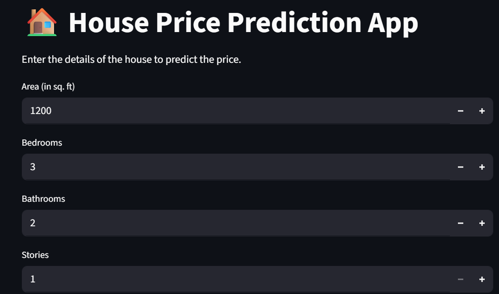
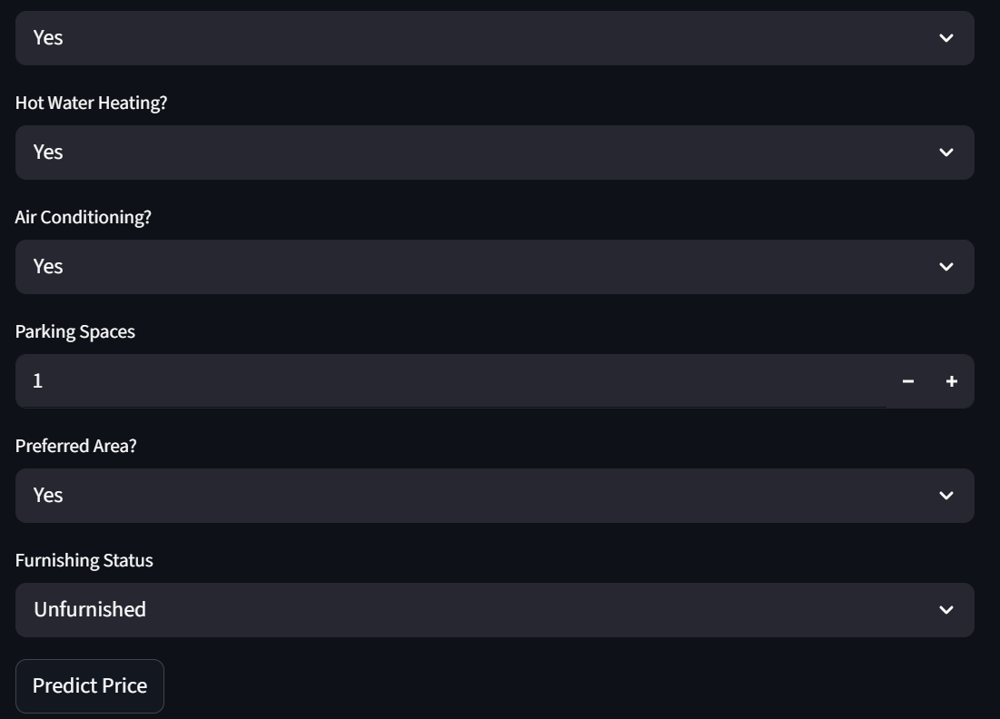

# house-price-prediction
# House Price Prediction

Machine Learning project that predicts house prices based on property features.

## Tech Stack
- Python
- Pandas
- Scikit-learn
- Streamlit

## Features
- Data preprocessing
- Model training
- Interactive web application for predictions

## Live App
Streamlit deployment link:
(Paste your app link here)

## Project Structure
house-price-prediction
│
├── House_Price_Prediction.ipynb
├── app.py
├── model.pkl
├── requirements.txt
└── README.md
## App Preview

### Input Interface

### Prediction Output

## Live Demo

Streamlit App:  
https://house-price-prediction-exnj2o4qhctfmxapsrzcje.streamlit.app/
